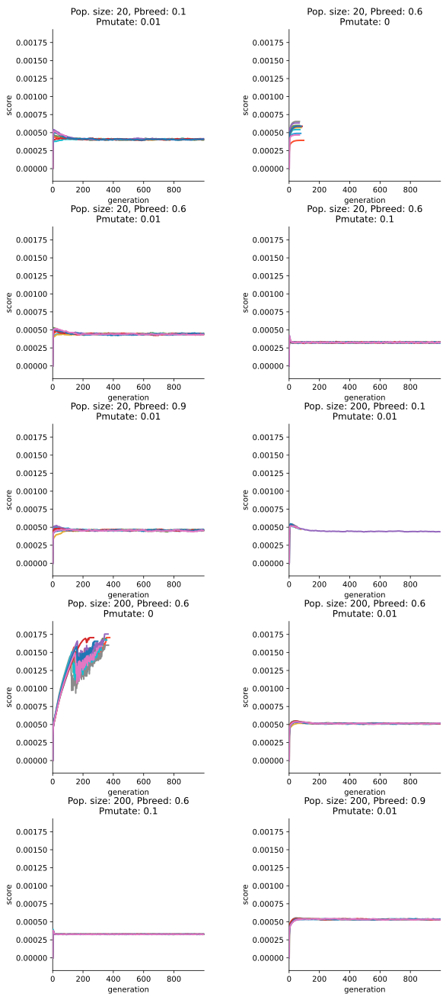

## ΚΩΔΙΚΟΠΟΙΗΣΗ

Λαμβάνοντας υπόψη πως πρέπει να μπορεί να αναπαρασταθεί κάθε πιθανό 
υποσύνολο λέξεων θα αναπαραστήσουμε κάθε άτομο ως bag-of-words, δηλαδή 
ένα bit αντιστοιχεί στην επιλογή ή όχι μιας λέξης.

## ΑΡΧΙΚΟΠΟΙΗΣΗ

Για την αρχικοποίηση του πληθυσμού επιλέγουμε για κάθε άτομο ένα τυχαίο 
ποσοστό και έπειτα επιλέγουμε τυχαία αυτό το ποσοστό λέξεων από τις 8520. 
Έτσι ο πληθυσμός έχει μεγαλύτερη ποικιλία στον αριθμό λέξεων και μπορεί πιο 
εύκολα να βρει λύσεις με αριθμούς λέξεων που απέχουν από το 50%.

## ΕΠΙΔΙΟΡΘΩΣΗ

Επειδή οι καλύτερες λύσεις βρίσκονται στο όριο με τις παράνομες, 
αν ο πληθυσμός φτάσει κοντά σε τέτοια λύση ένα μεγάλο ποσοστό των 
νέων μελών να μην είναι έγκυρες λύσεις. Αν επιλέξουμε απόρριψη ή 
αντιστοίχιση είναι πιθανό να χάνουμε πληροφορία από λύσεις πολύ κοντά 
στη βέλτιστη. Για αυτό το λόγο χρησιμοποιήθηκε εφαρμογή ποινής. 
Η ποινή που εφαρμόστηκε είναι **ΤΟΔΟ**

## ΣΥΝΑΡΤΗΣΗ ΚΑΤΑΛΗΛΟΤΗΤΑΣ

Η συνάρτηση καταλληλότητας που εφαρμόστηκε είναι το μέσο tf-idf των λέξεων 
που επιλέγει ως σημαντικές το άτομο κατά μέσο όρο ανά κείμενο με ποινή την 
ποινή παρανομίας που περιγράφεται παραπάνω αν το άτομο έχει λιγότερες από 1000 
λέξεις και μια σταθερά επί των λέξεων που έχει πάνω από 1000 αλλιώς. Η σταθερά 
επιλέχτηκε ώστε η συνάρτηση καταλληλότητας να έχει αποτέλεσμα 0 σε ένα άτομο 
που επιλέγει κάθε λέξη. Η μέγιστη τιμή που μπορεί να πάρει είναι 0.00266

## ΔΙΑΣΤΑΥΡΩΣΗ

Καθώς τα γονίδια αποτελούνται από 1 bit το καθένα και δεν υπάρχει κάποια 
συσχέτιση μεταξύ γειτονικών γονιδίων δεν υπάρχει λόγος να επιλέξουμε 
διασταύρωση μονού ή πολλαπλού σημείου από την ομοιόμορφη.

## ΕΠΙΛΟΓΗ

Η ρουλέτα με βάση τη κατάταξη δείχνει να υπερισχύει της ρουλέτας με βάση 
το κόστος σε αυτό το πρόβλημα καθώς ο πληθυσμός φτάνει συχνά σε κατάσταση 
που τα κόστη όλων των ατόμων είναι παρόμοια και σε τέτοιες περιπτώσεις 
η ρουλέτα κόστους δεν δίνει αρκετή ώθηση στα καλύτερα άτομα. 
Η επιλογή τουρνουά επιλέγει περισσότερα άτομα χαμηλότερης απόδοσης από την 
ρουλέτα κατάταξης που οδηγεί σε πιο αργή σύγκλιση. Επιλέχτηκε ρουλέτα κατάταξης.


## ΕΛΙΤΙΣΜΟΣ

Χρησιμοποιούμε σχετικά μικρούς πληθυσμούς, και ο ελιτισμός μειώνει περαιτέρω 
την ποικιλομορφία και οδηγεί σε πιο γρήγορη σύγκλιση, που συνήθως φαίνεται να 
δίνει χαμηλότερη απόδοση. Οπότε δεν χρησιμοποιήθηκε.

## ΠΙΝΑΚΑΣ ΑΠΟΤΕΛΕΣΜΑΤΩΝ

```{.python .cb-run include_file=ResTable.py }
```

## ΓΡΑΦΗΜΑΤΑ


